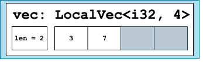

# `local_vec`

A *fixed-capacity* vector whose elements <b>stored *locally*</b>. In particular, they can be allocated on the [stack](#allocating-on-the-stack-or-the-heap).

---

`LocalVec` is a *fixed-capacity* vector, i.e., its *size* or *length* increases and decreases as elements are pushed into and popped from the vector, respectively. However, its *capacity* remains always the same and must be determined at [compile time](#compile-time-capacity).

The elements of a `LocalVec` are stored on a *local buffer* inside the `LocalVec` itself, not on a *remote buffer* allocated on the heap.

---

### `LocalVec` *vs* `Vec`

`LocalVec`'s elements reside locally, i.e., inside it:

    use local_vec::LocalVec;
    let mut vec = LocalVec::<_, 4>::new();
    vec.push(3);
    vec.push(7);
    
`vec` contents in the code above are:

  

That is, `vec` has a *local buffer* and the `i32` values `3` and `7` are stored inside `vec` itself, not in a *remotelly*-allocated buffer on the heap.

In contrast, [`Vec`](https://doc.rust-lang.org/std/vec/struct.Vec.html) allocates a *remote* buffer on the heap and contains a pointer to that buffer instead of the buffer itself:

    let mut v = Vec::with_capacity(4);
    v.extend([3, 7]);
    

  

### Compile-time capacity

Since the size of a `LocalValue` depends on its capacity, the capacity of a `LocalVec` must be determined at compile time. This is achieved with a constant generic argument thanks to *const generics*:

    let mut vec = LocalVec::<i32, 4>::new();
                                  |
        const generic argument <--|

### Allocating on the Stack or the Heap

Technically, the elements `LocalVec` contains are stored *locally*  in the `LocalVec`. Whether these elements are on the stack or not, depends on whether the `LocalVec` itself is allocated on the stack. For example:

# TODO

`vec` is allocated on the heap and so are the elements it contains. They are stored inside `vec` itself, though.

